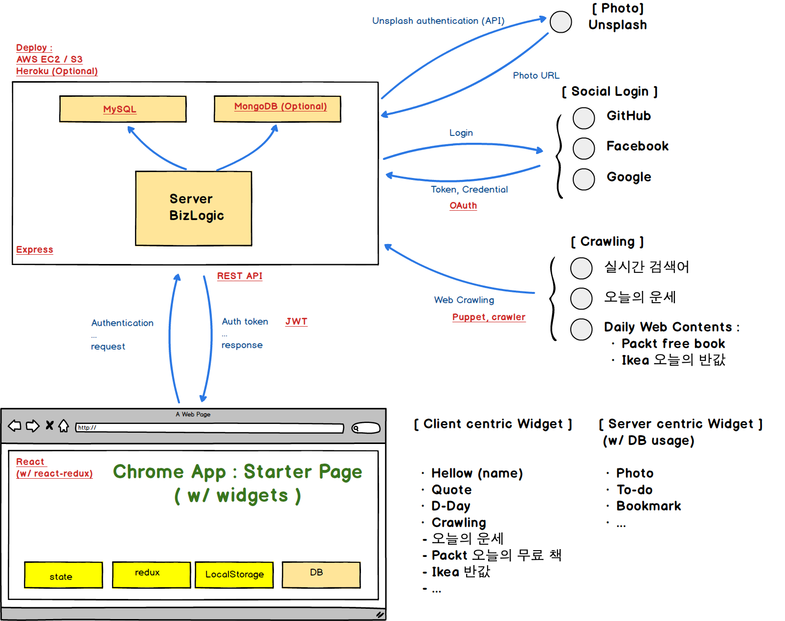

# IM09 2-week project : Present

## What is it ?

- Chrome app : starter page like [momentum](https://momentumdash.com/)

- Daily briefing with many widgets
  - Photo from [Unsplash](https://unsplash.com/developers)
  - Hello : User name
  - Quote (maxim)
  - D-Day
  - To-do
  - Bookmark (Optional)
  - Crawling : Fortune (오늘의 운세), Packt daily free book, Ikea daily 반값 deal, ...

## System Architecture

- Backend/Frontend configuartion
- How to interact
- ...

## Technical Stack

- Front-end
  - React (w/ react-redux), Browser localStorage
  - Chrome App packaging
- Back-end
  - OAuth (Social login), REST API, Open API usage (Unsplash, Quote, ...), Web Crawling (crawler, puppet)
  - Database : RDB (MySQL), NoSQL (MongoDB : Optional)
  - Deploy : Amazon AWS EC2/S3, Heroku

## Features

### Back-end

#### Features w/o login

- Unsplash photo management
  - Unsplash Server authentication
  - Photo management
- Quote (maxim)

#### Feature w/ login

- User Social login authentication
  - Facebook
  - Google
  - Twitter
  - Github
- Todo (w/ DB)

### Front-end

#### Features w/o login

- 홍보/안내 Web site
  - logic은 chrome app의 대부분 유사.
  - Chrome app insall button 추가.
- Setting UI
- (widget) link (famous website links)

#### Feature w/ login

- (widget) Weather
- (widget) D-Day
- (widget) Bookmark (w/ DB)
- (widget)(crawling) Packt daily free book
- (widget)(crawling) Naver 실시간 검색어
- (widget) Notes (w/ DB)

### ETC

- Chrome app package
